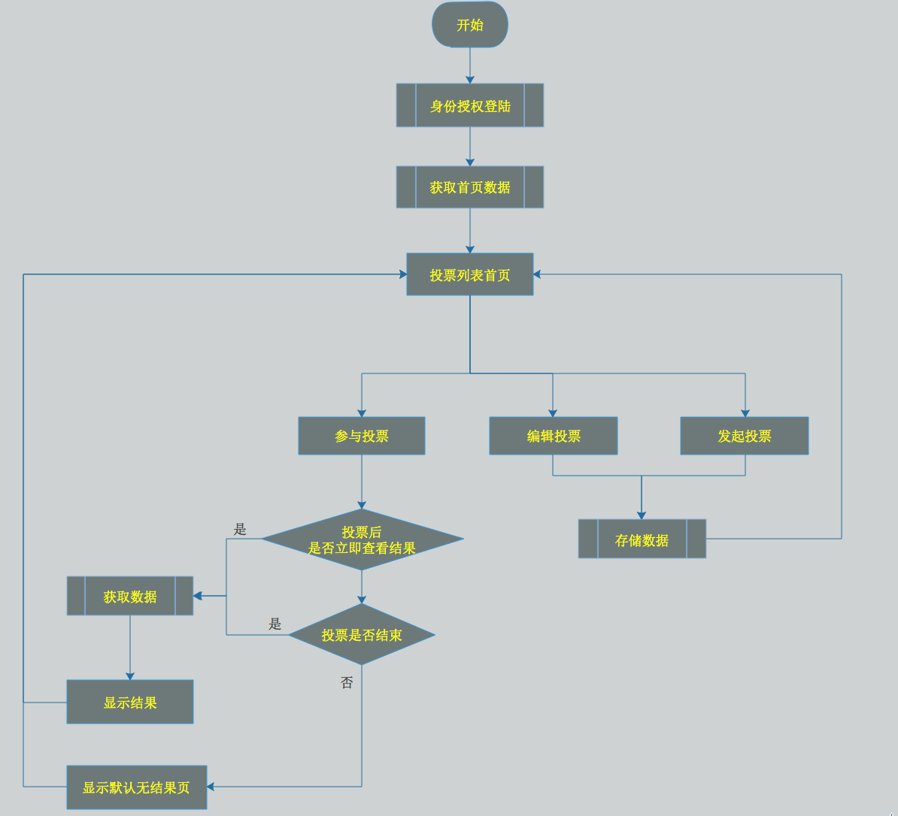
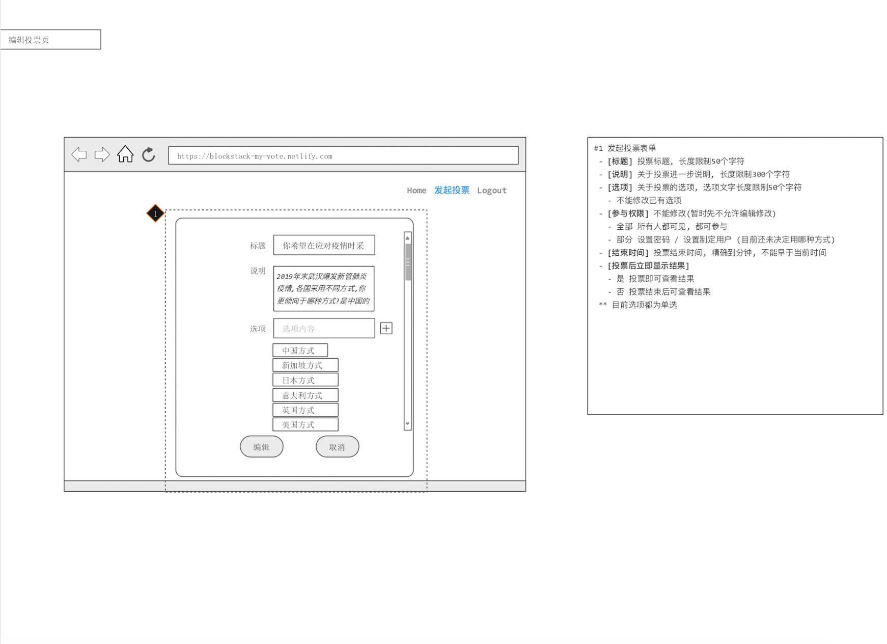

## 项目说明
该项目为匿名投票项目(blockstack应用demo)
>日常生活中当进行投票时无法真实表达自己的意愿<br>
>在该项目中匿名投票保护投票人的信息

## 项目启动

### `npm install`
安装项目依赖包

### `npm start`
启动项目.<br>
打开 [http://localhost:3000](http://localhost:3000) 来查看项目

### `npm run build`
编译项目代码

## 应用的blockstack技术点
- 身份登录授权
- 非明文数据共享
- 数据隐私
## 功能点介绍
- (一期) 查看投票列表
- (一期) 参与投票
- (一期) 发起 / 编辑投票
- (一期) 查看结果
- (简易版之后会慢慢增加数据的定向授权和分组相关的内容)
## 简易流程图


## 简易原型图(待定)
登陆页面


首页


发起投票页


编辑投票页


投票页


结果页(可见)


结果页(不可见)


## 数据说明
- user-latest.json<br>
>用于存储所有参与人的信息,按照时间顺序,数组格式

字段|存储类型|说明
---|---|---
id|string|用于记录blockstack.id
vote_id|string|用于存储最新发起投票的投票id
latest_dt|long|用于存储最新发起投票的时间戳,单位到秒

json例子<br>
   ```
   [
       {
           "id":"number_one.id.blockstack",
           "vote_id":"jdiosjfoiajoef",
           "latest_dt":1585066954
       },
       {
           "id":"number_two.id.blockstack",
           "vote_id":"1203ufosdf",
           "latest_dt":1585066989
       },
       {
           "id":"number_three.id.blockstack",
           "vote_id":"12390sfosdf",
           "latest_dt":1585066910
       }
   ]
   ```

- user-hot.json<br>
>用于存储所有参与人的信息,按照热门信息,数组格式

字段|存储类型|说明
---|---|---
id|string|用于记录blockstack.id
vote_id|string|用于存储投票数最多的投票id
votes|int|用于存储投票数

json例子<br>
   ```
   [
       {
           "id":"number_one.id.blockstack",
           "vote_id":"jdiosjfoiajoef",
           "votes":102
       },
       {
           "id":"number_two.id.blockstack",
           "vote_id":"1203ufosdf",
           "votes":3001
       },
       {
           "id":"number_three.id.blockstack",
           "vote_id":"12390sfosdf",
           "votes":5902
       }
   ]
   ```

- my.json
> 用于存储我发起的投票的数据, 数据加密, 数组格式

字段|存储类型|说明
---|---|---
vote_id|string|投票id
vote_title|string|投票标题,长度限制50个字符
vote_description|string|投票说明,长度限制300个字符
vote_options|数据包数组|投票选项
vote_auth|int|参与权限, 0=全部, 1=部分
vote_result|int|投票后是否立即查看结果, 0=是, 1=否
vote_endtime|long|投票结束时间时间戳,单位到秒
create_dt|long|创建时间时间戳,单位到秒
update_dt|long|更新时间时间戳,单位到秒

vote_options的字段说明

字段|存储类型|说明
---|---|---
vote_option_id|string|投票选项id
vote_option_content|string|投票选项内容,长度限制50个字符
vote_option_sort|int|投票选项排序,默认从1开始
vote_option_cnts|int|投票数

json例子<br>
```
[
    {
        "vote_id":"",
        "vote_title":"",
        "vote_description":"",
        "vote_options":[
            {
                "vote_option_id":"dsfuhwoe",
                "vote_option_content":"",
                "vote_option_sort":1,
                "vote_option_cnts":10
            },
            {
                "vote_option_id":"sdfj1",
                "vote_option_content":"",
                "vote_option_sort":2,
                "vote_option_cnts":14
            }
        ],
        "vote_auth":0,
        "vote_result":0,
        "vote_endtime":1585066910,
        "create_dt":1585066990,
        "update_dt":1585066990
    },
    {
        "vote_id":"",
        "vote_title":"",
        "vote_description":"",
        "vote_options":[
            {
                "vote_option_id":"dsfuhwoe",
                "vote_option_content":"",
                "vote_option_sort":1,
                "vote_option_cnts":10
            },
            {
                "vote_option_id":"sdfj1",
                "vote_option_content":"",
                "vote_option_sort":2,
                "vote_option_cnts":14
            }
        ],
        "vote_auth":0,
        "vote_result":0,
        "vote_endtime":1585066910,
        "create_dt":1585066990,
        "update_dt":1585066990
    }
]
```


- vote.json
> 用于存储我参与投票的数据, 数据加密, 数组格式

字段|存储类型|说明
---|---|---
vote_id|string|参与的投票id
vote_option_id|string|参与的投票选项id
create_dt|long|参与投票时间时间戳,单位到秒
vote_create_id|string|发起投票人的blockstack.id

json例子
```
[
    {
        "vote_id":"",
        "vote_option_id":"",
        "create_dt":1585066990,
        "vote_create_id":"number_one.id.blockstack"
    },
    {
        "vote_id":"",
        "vote_option_id":"",
        "create_dt":1585066990,
        "vote_create_id":"number_two_id.blockstack"
    }
]
```